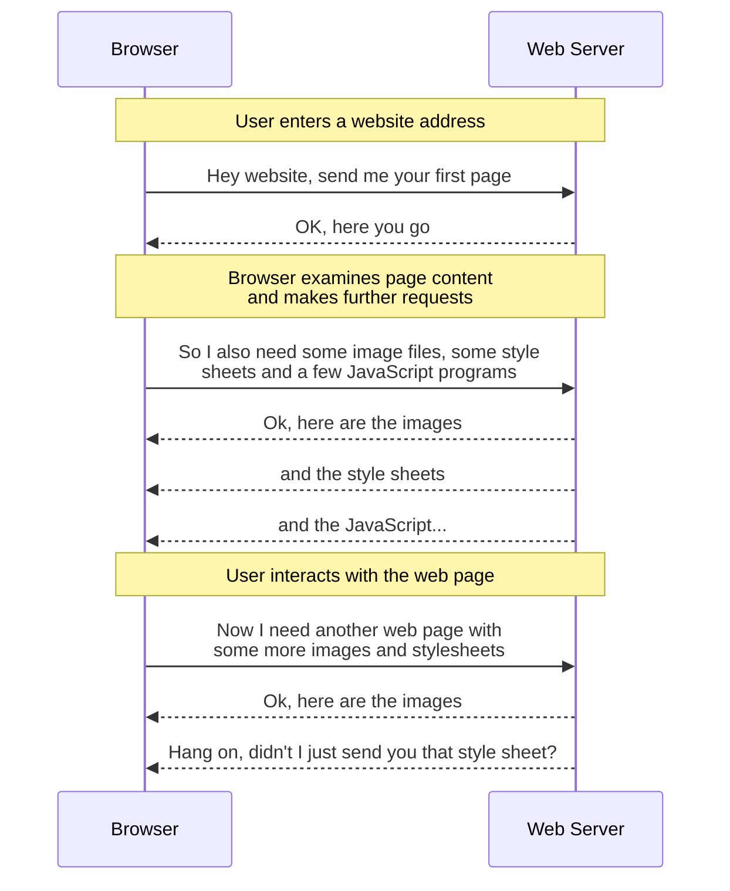

# WARP Proposal

## Introduction

Any time a person uses a computer to access information over the Worldwide Web, buy something from an online vendor, or perform some sort of productivity task (such as writing a document, using a shared calendar or creating a business document), they will, mostly likely, perform that task using a Web Browser.

However, the machine on which the Web Browser (the client) runs is frequently located at a large physical distance from the Web Server with which they are interacting.
This in turns means that the data involved in each request/response cycle must travel through a potentially large number of network switches, routers and servers before completing its round trip.

It is therefore self-evident that the fewer intermediate steps there are in this "_journey through the network_", the quicker the request/response cycle can be completed.

In simplistic terms, the request/response cycle between a Web Browser and a Web Server looks something like this:

Whilst all browsers operate their own local cache to avoid requesting a resource they have already been sent, it is not always possible for a browser to recognise that it is requesting the same resource.

This might be because the URL pointing to a particular resource might use a dynamically generated path (or even file) name which changes between visits or between user sessions: yet the actual resource behind the request remains the same.

## Motivation

### Problem Description

If a user located in Singapore is interacting with a website hosted in a data centre on the US East Coast, they may experience a noticeable delay between clicking on a link and seeing the response in their browser.

This is due simply to the fact that the Worldwide Web is exactly that - worldwide.
Consequently, if two computers on opposite sides of the planet wish to talk to each other, their requests and responses must traverse a complex network topology and pass through a large number of intervening switches, routers and servers in order to complete a single round trip.

Users will tolerate a certain amount of delay at certain points in the interaction sequence, but if that delay is either sufficiently frequent or becomes sufficiently large, then they will typically become frustrated and eventually stop using the website.

### Proposed Benefits

This proposal aims to reduce the network round trip time by reducing the "_network distance_" between the client and server.
So rather than the server being located deep within a network (with all the accompanying traffic delays needed for the request to get in and the response to get out), the request can be answered by a server located very close to, or even on, the "edge" of the network.

So in the case of our user in Singapore, if this "edge-cache" software were installed on servers running in a local Singapore data centre, then they would experience much faster response times simply because the "_network distance_" between client and server is shorter.

Software that implements this "edge-cache" functionality is part of the wider category of software forming what is called a Content Delivery Network (CDN). 

Wasmer Edge is the name of Wasmer's content delivery network (CDN) offering and this proposal aims to extend its functionality by adding CDN caching capability.

### Impact

From a technical perspective, to implement a correct, scalable and robust cache layer from scratch is a highly complex task requiring both specialist skills and an extended period of development time.

From an entirely pragmatic perspective, this is beyond the reach of a small company such as Wasmer: and even if a home-grown product was somehow to be built successfully, if it could not demonstrate feature parity with existing CDN offerings, then there is a serious risk that customer confidence will be undermined.

Consequently, it makes sense for Wasmer to use Open Source Rust software delivered by a CDN specialist company such as Cloudflare as they have already done the technical "heavy lifting" for us; specifically, their Pingora framework.

This would involve using both the `pingora-proxy` and the `pingora-cache` crates.

Such an approach allows Wasmer to implement the required functionality at a lower cost and results in a much smaller operational burden.

From a product perspective however, even after an edge-cache has been built using `pingora-cache`, this may only bring Wasmer up to basic parity with other CDN offerings.
In order to make the Wasmer Edge product stand out, further usability features will be needed that could include:
* A dashboard that allows admin activity such as monitoring cache performance, manual cache purges etc
* Perform the same tasks as above but programmatically via an API
* Other features I haven't thought of yet

But first things first&hellip;

## Explanation

Explanation of the proposal.

This should be either short and broad for exploratory WARPs, or very detailed, depending on the context.

## Drawbacks & Alternatives

The main downside of implementing this proposal is that although Cloudflare state that [Pingora is battle tested...](https://github.com/cloudflare/pingora?tab=readme-ov-file#what-is-pingora), they also explicitly state that [Pingora proxy integration with caching should be considered experimental](https://github.com/cloudflare/pingora?tab=readme-ov-file#what-is-pingora), and as such APIs related to caching are currently highly volatile.

Looking through the `pingora-cache` repository, the `memory` module is specifically identified as [not being production ready](https://github.com/cloudflare/pingora/blob/b3c186177e8ff59f047ed05aa7b88735bb623c2f/pingora-cache/src/memory.rs#L17).
Although none of the other modules contain such an explicit warning, this offers no guarantee that volatility will be confined simply to this one module.

Given Cloudflare's warning, it should be considered a ***high risk*** venture to build software a foundation known to be volatile - especially if that software needs to be production-ready.

The risks of writing software on this foundation include:
* Building critical functionality on top of a feature that is substantially altered or maybe even disappears
* Building on top of functionality that turns out to be inefficient or even buggy

This could potentially lead to a situation in which Wasmer is locked into the current version of `pingora-cache` because upgrading to a higher minor version introduces a breaking change.

### Alternatives

***Commercial Products*** 
Commercial CDN cache products are also available, but each comes with some variation of request volume based pricing:
* <https://bunny.net/pricing>
* <https://keycdn.com/pricing> (Focussed on Europe)
* <https://www.cdn77.com/pricing>

The chief risks of building edge-cache functionality on top of a paid-for product are these:
* The ongoing costs payable to the third-party will
  * increase as Wasmer's user base grows
  * become a fixed running cost that cannot be reduced without significant effort  
* In future, should it become necessary to detach the product from third-party dependencies, then further development time and effort must be spent detaching from one cache solution and then transitioning to another cache solution - all without disrupting the existing functionality.

***Open Source Alternatives*** 
Alternative OSS caching proxies are available that include:

* [Varnish HTTP Cache](https://varnish-cache.org/)
   - **Pros:** Widely used by key players such as Akamai and Fastly
   - **Cons:** Written in C not async Rust
 
* [Apache Traffic Server](https://trafficserver.apache.org/)

   - **Pros:** Offers large-scale distributed caching and advanced routing
   - **Cons:** A large product with a steep learning curve
 
* [Nginx + `proxy_cache`](https://nginx.org/index.html)

   - **Pros:** Widely used and well known
   - **Cons:** The `proxy_cache` module offers only basic cache capability.

     To get more advanced features that would differentiate Wasmer Edge as a product from other edge caches, the paid-for version would need to be used.  
 
* [SOZU Proxy](https://www.sozu.io/)

   - **Pros:** Written in async Rust with an always-on, hot-reload style architecture
   - **Cons:** Not as mature and therefore not as battle-hardened

     To get more advanced features that would differentiate Wasmer Edge as a product from other edge caches, the paid-for version would need to be used.  
