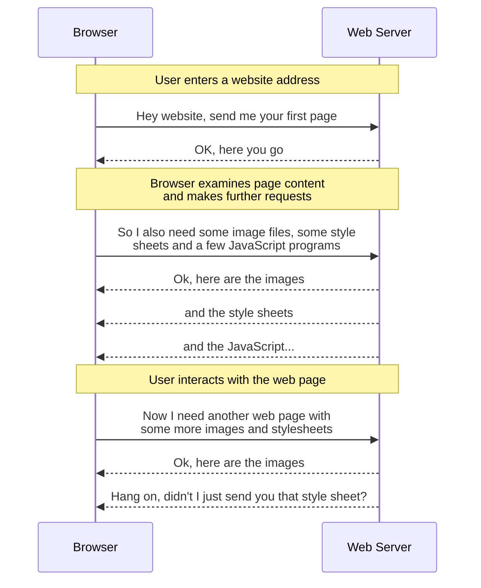

- [Introduction](#introduction)
- [Motivation](#motivation)
  - [Problem Description](#problem-description)
  - [Proposed Benefits](#proposed-benefits)
  - [Impact](#impact)
- [Explanation](#explanation)
  - [Requirements](#requirements)
    - [1. High Concurrency Support](#1-high-concurrency-support)
    - [2. Good Tokio Runtime Integration](#2-good-tokio-runtime-integration)
    - [3. Low Memory Consumption](#3-low-memory-consumption)
    - [4. Expose Cache Performance \& Activity Statistics](#4-expose-cache-performance--activity-statistics)
    - [5. Integrate well with the Pingora `EvictionManager`](#5-integrate-well-with-the-pingora-evictionmanager)
    - [6. Tiered Cache Architecture](#6-tiered-cache-architecture)
    - [7. Configurable Cache Behaviour](#7-configurable-cache-behaviour)
  - [Startup](#startup)
  - [Implementation of `pingora_proxy::ProxyHttp`](#implementation-of-pingora_proxyproxyhttp)
  - [Implementation of `pingora_cache::Storage`](#implementation-of-pingora_cachestorage)
  - [Open Questions and Limitations of the Current Implementation](#open-questions-and-limitations-of-the-current-implementation)
    - [Tiered Architecture](#tiered-architecture)
    - [Metrics at Startup](#metrics-at-startup)
    - [Administrator's Dashboard](#administrators-dashboard)
      - [Useful Administrative Features](#useful-administrative-features)
- [Drawbacks \& Alternatives](#drawbacks--alternatives)
  - [Drawbacks](#drawbacks)
  - [Alternatives](#alternatives)
    - [Commercial Products](#commercial-products)
    - [Open Source Alternatives](#open-source-alternatives)

---

# Introduction

Any time a person uses a computer to access information over the Worldwide Web, buy something from an online vendor, or perform some sort of productivity task (such as writing a document, using a shared calendar or creating a business document), they will, mostly likely, perform that task using a Web Browser.

However, the machine on which the Web Browser (the client) runs is frequently located at a large physical distance from the Web Server with which they are interacting.
This in turns means that the data involved in each request/response cycle must travel through a potentially large number of network switches, routers and servers before completing its round trip.

It is therefore self-evident that the fewer intermediate steps there are in this "_journey through the network_", the quicker the request/response cycle can be completed.

In simplistic terms, the request/response cycle between a Web Browser and a Web Server looks something like this:



Whilst all browsers operate their own local cache to avoid requesting a resource they have already been sent, it is not always possible for a browser to recognise that it is requesting the same resource.

This might be because the URL pointing to a particular resource might use a dynamically generated path (or even file) name which changes between visits or between user sessions: yet the actual resource behind the request remains the same.

# Motivation

## Problem Description

If a user located in Singapore is interacting with a website hosted in a data centre on the US East Coast, they may experience a noticeable delay between clicking on a link and seeing the response in their browser.

This is due simply to the fact that the Worldwide Web is exactly that - worldwide.
Consequently, if two computers on opposite sides of the planet wish to talk to each other, their requests and responses must traverse a complex network topology and pass through a large number of intervening switches, routers and servers in order to complete a single round trip.

Users will tolerate a certain amount of delay at certain points in the interaction sequence, but if that delay is either sufficiently frequent or becomes sufficiently large, then they will typically become frustrated and eventually stop using the website.

## Proposed Benefits

This proposal aims to reduce the network round trip time by reducing the "_network distance_" between the client and server.
So rather than the server being located deep within a network (with all the accompanying traffic delays needed for the request to get in and the response to get out), the request can be answered by a server located very close to, or even on, the "edge" of the network.

So in the case of our user in Singapore, if their requests are routed through servers running in a local Singapore data centre, and those servers are also running this "edge-cache" software, then the user would experience much faster response times simply because the "_network distance_" between the client and the server is shorter.

Software that implements this "edge-cache" functionality is part of the wider category of software forming what is called a Content Delivery Network (CDN).

## Impact

From a technical perspective, to implement a correct, scalable and robust cache layer from scratch is a highly complex task requiring both specialist skills and an extended period of development time.
Consequently, it makes sense to use an Open Source Rust framework delivered by a company specialising in CDN software as they have expertise to perform the technical "heavy lifting".

Cloudflare's Rust-based Pingora framework is a candidate here; specifically, the `pingora-proxy` and `pingora-cache` crates.

From a product perspective however, even after an edge-cache has been built using this software, this may only achieve parity with other CDN offerings.
In order to make this product stand out, further usability features will be needed that could include:
* A dashboard that allows admin tasks to be performed such as monitoring cache performance and manual cache purges etc
* Perform the same tasks as above but programmatically via an API
* Other features I haven't thought of yet

# Explanation

## Requirements

This implementation should meet, or at least make provision for meeting, the following criteria:

1. Support for highly concurrent activity
2. Integrate well with the Tokio runtime
3. Ensure good scalability by keeping memory consumption low
4. Expose cache performance and activity statistics (compatible with Prometheus metrics).
5. Integrate well with the `pingora_cache` `EvictionManager` to control the local cache size/population.
6. Allow for a tiered cache architecture: primary cache is the local disk; the secondary cache is a shared or distributed cache layer accessible by multiple servers.
7. Configurable cache behaviour

### 1. High Concurrency Support

Cloudflare are specialists in the area of managing network traffic and distributed connectivity; therefore, the Pingora Framework has been delivered with built-in support for high levels of concurrency.

### 2. Good Tokio Runtime Integration

This is also an off-the-shelf design feature of the Pingora Framework.

### 3. Low Memory Consumption

The current implementation ensures that memory consumption is kept low by writing cached objects to disk rather than keeping them in memory.

### 4. Expose Cache Performance & Activity Statistics

Currently, the following metrics are kept:

| Metric           | Type      | Description                                                                   |
|------------------|-----------|-------------------------------------------------------------------------------|
| `lookup_hits`    | Monotonic | Cache lookup counter                                                          |
| `served_hits`    | Monotonic | Count of cached object successfully delivered to the client                   |
| `misses`         | Monotonic | Count of cache lookup failures                                                |
| `inserts`        | Monotonic | Count of a new objects added to the cache                                     |
| `purge_attempts` | Monotonic | Incremented each time the `EvictionManager` decides to remove a cached object |
| `evictions`      | Monotonic | Incremented each time a cached object is successfully removed from the cache  |
| `evicted_bytes`  | Monotonic | The total number of bytes removed from the cache                              |
| `size_bytes`     | Variable  | The current size of the cache                                                 |

These metrics are exposed in a format compatible with Prometheus and can be accessed via <http://localhost:8080/metrics>

The cache contents can be displayed via a bare-bones display <http://localhost:8080/cache>.

### 5. Integrate well with the Pingora `EvictionManager`

The `EvictionManager` is invoked automatically by the Pingora `HttpCache` when it detects that the cache contents need to be altered.
Typically, the eviction manager decides that an object should be removed from the cache because some time or size threshold has been exceeded.

The eviction policy used by the `EvictionManager` is defined at the time the cache is created.
In this demo, the "Least Recently Used" (LRU) policy has been chosen.

```rust
pub const DEFAULT_CACHE_SIZE_BYTES: usize = 2 * 1024 * 1024 * 1024; // Default cache size = 2Gb

// Just use LRU at the moment
pub struct EvictionManagerCfg {
    pub max_bytes: usize,
}

static EVICTION_MANAGER_CFG: OnceLock<EvictionManagerCfg> = OnceLock::new();
pub fn eviction_manager_cfg() -> &'static EvictionManagerCfg {
    EVICTION_MANAGER_CFG.get_or_init(|| EvictionManagerCfg {
        max_bytes: env_var_or_num("CACHE_SIZE_BYTES", DEFAULT_CACHE_SIZE_BYTES),
    })
}

static EVICTION_MANAGER: OnceLock<LruManager> = OnceLock::new();
pub fn eviction_manager() -> &'static LruManager {
    EVICTION_MANAGER.get_or_init(|| LruManager::new(eviction_manager_cfg().max_bytes))
}
```

Where `LruManager` is an alias for `pingora_cache::eviction::simple_lru::Manager`.

This eviction policy is then applied to the selected cache when `pingora_proxy::ProxyHttp::request_cache_filter()` is called.

### 6. Tiered Cache Architecture

The actual `DiskCache` object is declared as follows and acts as the primary cache.

```rust
static CACHE_DIR: OnceLock<String> = OnceLock::new();
pub fn cache_dir() -> &'static str {
    CACHE_DIR.get_or_init(|| format!("{}/cache", runtime_dir()))
}

static DISK_CACHE: OnceLock<DiskCache> = OnceLock::new();
pub fn disk_cache() -> &'static DiskCache {
    DISK_CACHE.get_or_init(|| DiskCache::new(cache_dir()))
}
```

An instance of the following struct is then created with the `primary` field set equal to the disk cache.
In this case, the `secondary` cache is optional:

```rust
pub struct TieredStorage {
    primary: &'static (dyn Storage + Sync),
    secondary: Option<&'static (dyn Storage + Sync)>,
    write_policy: WritePolicy,
}

static TIERED: OnceLock<TieredStorage> = OnceLock::new();
pub fn tiered_cache() -> &'static TieredStorage {
    TIERED.get_or_init(|| {
        TieredStorage::new(
            disk_cache(),
            None,
            // Some(remote_cache()),  // Need to implement this
            WritePolicy::PrimaryOnly, // Switches to WriteThroughBoth when remote is available
        )
    })
}
```

In order to operate a tiered lookup, the `TieredStorage` struct must also implement `pingora_cache::Storage` so that when its `lookup` function is called, rather than interacting directly with the disk cache, it first calls `lookup` on the primary cache.
If that fails, it attempts to call `lookup` on the secondary (if one exists).

### 7. Configurable Cache Behaviour

Currently, the following aspects of the cache can be configured at start up by setting the following environment variables:

| Environment Variable | Default Value            | Description                           |
|----------------------|--------------------------|---------------------------------------|
| `CACHE_DIR`          | `./.cache`               | The root directory for the disk cache |
| `CACHE_SIZE_BYTES`   | `2 * 1024 * 1024 * 1024` | Default cache size (2Gb)              |
| `PROXY_HTTP_PORT`    | `6143`                   | Default port for HTTP connections     |
| `PROXY_HTTPS_PORT`   | `6188`                   | Default port for HTTPS connections    |

If any of these environment variables are missing, the default values will be used instead.
In the case of variables that should hold numeric values, if the value cannot be parsed as a number, then the default will also be used.

---

## Startup

The `main` function creates a lazy static instance of `DiskCache` called `DISK_CACHE`, which is then used as the primary cache within the `TIERED` cache object.

After this, a proxy is created that implements `pingora_proxy::ProxyHttp`.
Within this proxy is an implementation of the `request_cache_filter` function.
This function is called when the proxy receives an incoming request for an object, and it is within this function that the decision is made to enable (or not) a particular cache for the current request session.

In other words, should you need it, the Pingora framework provides the flexibility to implement request specific caches.

Assuming a cache is enabled for the current request session (in this PoC, only the `DISK_CACHE` is available), the Pingora Framework then calls the `DiskCache::lookup()` function for the requested resource.
This function determines whether the file is present in the disk cache.
The first request for a resource will always return `None` because we have not yet obtained this object; but a cache hit returns an object that implements `pingora_cache::Storage::HandleHit`.

If the Pingora framework receives `None` from a lookup, it then calls our implementation of the `DiskCache::get_miss_handler` function to obtain an object that implements `HandleMiss`

Either way, hits are handled by a `HitHandler` and misses by a `MissHandler`

## Implementation of `pingora_proxy::ProxyHttp`

The struct `EdgeCdnProxy` implements the trait `pingora_proxy::ProxyHttp`.
This means it can act as a standard proxy managed by the Pingora Framework.

The following functions need to be implemented:

* ***`new_ctx`***<br>
   Creates a new proxy context.
   This demo does not use a proxy context.

* ***`upstream_peer`***<br>
   By examining the contents of the incoming request, this function calculates how to communicate with the upstream server.

   In this case, it first fetches the HTTP header `Host`.
   Then it works out how to communicate with the upstream server by first looking for the value of the pseudo-header `:scheme`.
   If this cannot be found, it then looks for the value of the request header `X-Forwarded-Proto`.
   If that cannot found, it drops back to `http`.

   Once these values have been derived, it returns a `pingora_core::upstreams::peer::HttpPeer` that tells Pingora how to communicate with the upstream server.

* ***`request_cache_filter`***<br>
   As long as the request does not create a request feedback loop (I.E. a request aimed at the proxy itself), this function connects the `DISK_CACHE` with the received `session` object.

* ***`cache_key_callback`***<br>
   This function generates a `CacheKey` for the currently requested resource.
   In this demo implementation, the `CacheKey` is generated using only the `primary` value; the `namespace` and `user_tag` parts are not used.

* ***`cache_hit_filter`***<br>
   Pingora calls this function after a successful cache hit and can optionally be used to invalidate a cached resource.

* ***`response_cache_filter`***<br>
   Pingora calls this function to decide if the resource is cacheable.

   It is very important to honour the contents of the `cache-control` header and not cache any object marked as `no-store`.

   This implementation also arbitrarily refuses to cache objects that are not returned with an HTTP 2xx status code.

* ***`upstream_response_filter`***<br>
  Sets the HTTP header `X-CDN-Cache: MISS` to record the fact that the object was not served from the cache.


* ***`response_filter`***<br>
  Sets the HTTP header `X-CDN-Cache` to `MISS` or `HIT` depending on whether the object was served from the cache.

## Implementation of `pingora_cache::Storage`

The `DiskCache` struct implements the trait `pingora_cache::Storage` and acts as the interface between the Pingora Framework and the cached objects stored on disk.
The implemented functions are called automatically by the Pingora Framework as it handles an incoming request for content.

* **`lookup`**<br>
  For a given `CacheKey`, this function examines the storage in which the cached object might be located and returns either an appropriate hit handler or `None`.

* **`get_miss_handler`**<br>
  Called if `lookup` returns `None`.
  This function writes the cached object's metadata to the storage and returns a handler that will be called at such time as the body of the requested object arrives.

* **`purge`**<br>
  Called when the `EvictionManager` decides that a particular object must be removed from the cache.

* **`update_meta`**<br>
  `update_meta` is called to refresh the stored headers/TTL for an object that already exists in storage, but the body has not changed.

* **`as_any`**<br>
  A hook function in which you could cast the cached object to some concrete type.

## Open Questions and Limitations of the Current Implementation

### Tiered Architecture

A tiered cache architecture raises the following questions:

1. If we get a miss from the primary cache, but a hit in the secondary, should that object be promoted to the primary?

   If the answer is yes, then the current implementation of `DiskCache` will need to implement its own "admin hook" that permits the insertion of a new object without interfering with or confusing the operation of the `EvictionManager`.

   Pingora does not appear offer a built-in mechanism for object promotion, so one would have to be designed.

2. In order to reduce potential response latency, it might be worth considering whether the extra workload of a hedged lookup is acceptable.

   In other words, we set an arbitrary response time within which the primary cache should respond.
   If that time threshold is exceeded, then we pre-emptively request the object from the secondary cache and then use the object from whichever cache answers first.

   ***CAVEAT:***<br>
   If badly configured, the "primary cache response time" could have a negative impact on cache performance; therefore it would need to be monitored and tuned carefully.
   Consequently, such a value should not be implemented without providing a corresponding ability to adjust it dynamically.

### Metrics at Startup

Cache metrics are not persisted when the server shuts down; therefore, when the server restarts, all the cached object are still present on disk, but the metrics accumulated during the creation of the current cache state have been lost.

### Administrator's Dashboard

What dashboard?  🤣

The current display of the cache contents is a bare-bones implementation that currently offers no administrative tools.
Such tools need to be implemented.

#### Useful Administrative Features

1. Change the cache size without having to restart the server.

   This could be achieved by implementing a wrapper around `EvictionManager`, but the actual details need further investigation.

2. Hot Upgrade.

   By wrapping the actual proxy server in an admin wrapper, an Erlang-style hot upgrade could be implemented.

# Drawbacks & Alternatives

## Drawbacks

The main downside is that although Cloudflare state that [Pingora is battle tested...](https://github.com/cloudflare/pingora?tab=readme-ov-file#what-is-pingora), they also explicitly state that [Pingora proxy integration with caching should be considered experimental](https://github.com/cloudflare/pingora?tab=readme-ov-file#notable-crates-in-this-workspace), and as such APIs related to caching are currently highly volatile.

Looking through the `pingora-cache` repository, the `memory` module is specifically identified as [not being production ready](https://github.com/cloudflare/pingora/blob/b3c186177e8ff59f047ed05aa7b88735bb623c2f/pingora-cache/src/memory.rs#L17).
Although none of the other modules contain such an explicit warning, this offers no guarantee that volatility will be confined simply to the `memory` module.

Given Cloudflare's warning, the risks associated with building mission-critical software on a foundation known to be volatile should be evaluated.
If these risk are considered acceptable, then the following possibilities must be accepted.
This solution may find itself depending on functionality that:
* is substantially altered or even disappears as part of a future minor release; or
* turns out to be inefficient or even buggy; or
* makes the possibility of an upgrade difficult without significant effort or rework.

## Alternatives

### Commercial Products

[Numerous commercial CDN cache products](https://www.streamingmediablog.com/2023/01/cdn-list.html) are available, of which a tiny selection is listed here, and all of which use some variation of volume-based pricing:

* <https://bunny.net/pricing>
* <https://keycdn.com/pricing> (Focussed on Europe)
* <https://www.cdn77.com/pricing>

The chief risks of building edge-cache functionality on top of a paid-for product are these:
* The ongoing costs payable to a third party will
    * increase as the user base (and therefore throughput) grows
    * become a unavoidable running cost that cannot be reduced without significant effort
* In future, should it become necessary to detach this solution from such third-party dependencies, then further development time and effort must be spent detaching from one cache solution and then transitioning to another cache solution - all without disrupting the existing functionality.

### Open Source Alternatives

It would be prudent to consider some of the alternative OSS caching proxies solutions.
These include:

* [Varnish HTTP Cache](https://varnish-cache.org/)

  ✅ Widely used by key players such as Akamai and Fastly<br>
  ❌ Written in C not async Rust, so carries a set of interoperability challenges <sup id="a1">[1](#f1)</sup>

* [Apache Traffic Server](https://trafficserver.apache.org/)

  ✅ Offers large-scale distributed caching and advanced routing<br>
  ❌ A large product with a steep learning curve

* [Nginx + `proxy_cache`](https://nginx.org/index.html)

  ✅ Both the free and paid-for versions are widely used and well known<br>
  ❌ The `proxy_cache` module available in the free version offers only basic cache capability.

  To get access to more advanced features, the paid-for version would need to be used.

* [SOZU Proxy](https://www.sozu.io/)

  ✅ Written in async Rust with an Erlang-style always-on, hot-reload architecture<br>
  ❌ Not as mature and therefore not as battle-hardened

---

<b id="f1">1</b>&nbsp;&nbsp; Implementing Varnish from async Rust certainly can be done, but it comes with the following extra considerations:
1. Varnish would probably need to be run as a sidecar per proxy node.  This is more memory hungry, but keeps the implementation simpler.
1. Varnish is controlled using either HTTP, its own API or its Control Interface (CLI).  This therefore incurs at least one extra network hop which in turn increases latency.
1. Rust calls to the Varnish API should be done using a separate thread pool (`tokio::task::spawn_blocking`)
1. In order to maintain consistent observability, Varnish's metrics (collected using `Varnishstat`) would have to be integrated with whatever metrics pipeline this proxy uses (Prometheus)
1. Increased operational burden due to Varnish having its own configuration, tuning and patching requirements
1. Implementing more fine-grained controls such as cache purge by header, or tenant isolation can be done, but the Rust proxy can only do so via Varnish's CLI
1. Debugging will be harder because both the Rust and Varnish (C) sides of the functionality will need to be traced.

[↩](#a1)
