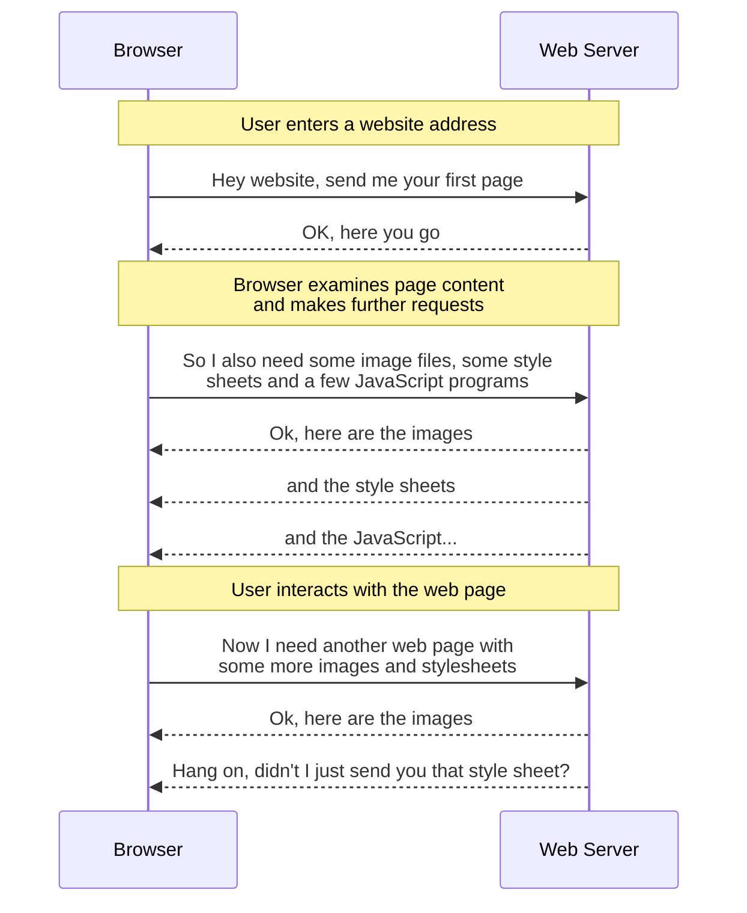

# Introduction

Any time a person uses a computer to access information over the Worldwide Web, buy something from an online vendor, or perform some sort of productivity task (such as writing a document, using a shared calendar or creating a business document), they will, mostly likely, perform that task using a Web Browser.

However, the machine on which the Web Browser (the client) runs is frequently located at a large physical distance from the Web Server with which they are interacting.
This in turns means that the data involved in each request/response cycle must travel through a potentially large number of network switches, routers and servers before completing its round trip.

It is therefore self-evident that the fewer intermediate steps there are in this "_journey through the network_", the quicker the request/response cycle can be completed.

In simplistic terms, the request/response cycle between a Web Browser and a Web Server looks something like this:

Whilst all browsers operate their own local cache to avoid requesting a resource they have already been sent, it is not always possible for a browser to recognise that it is requesting the same resource.

This might be because the URL pointing to a particular resource might use a dynamically generated path (or even file) name which changes between visits or between user sessions: yet the actual resource behind the request remains the same.