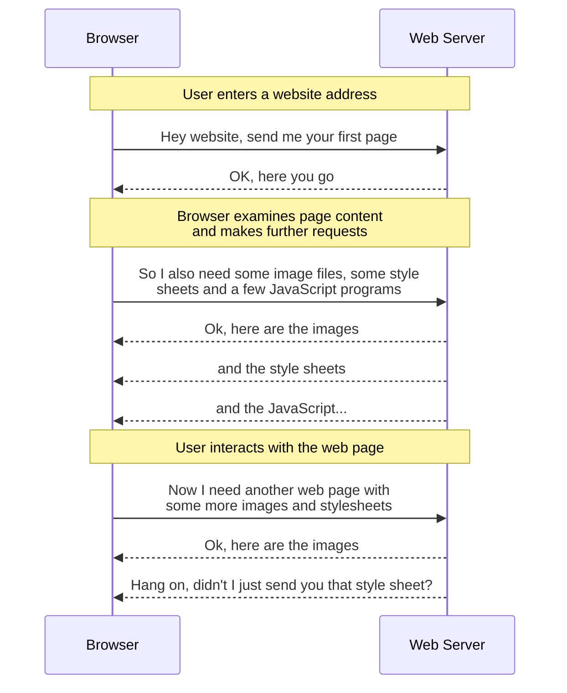

# WARP Proposal

# Introduction

Any time a person uses a computer to access information over the Worldwide Web, buy something from an online vendor, or perform some sort of productivity task (such as writing a document, using a shared calendar or creating a business document), they will, mostly likely, perform that task using a Web Browser.

However, the machine on which the Web Browser (the client) runs is frequently located at a large physical distance from the Web Server with which they are interacting.
This in turns means that the data involved in each request/response cycle must travel through a potentially large number of network switches, routers and servers before completing its round trip.

It is therefore self-evident that the fewer intermediate steps there are in this "_journey through the network_", the quicker the request/response cycle can be completed.

In simplistic terms, the request/response cycle between a Web Browser and a Web Server looks something like this:

Whilst all browsers operate their own local cache to avoid requesting a resource they have already been sent, it is not always possible for a browser to recognise that it is requesting the same resource.

This might be because the URL pointing to a particular resource might use a dynamically generated path (or even file) name which changes between visits or between user sessions: yet the actual resource behind the request remains the same.

# Motivation

## Problem Description

If a user located in Singapore is interacting with a website hosted in a data centre on the US East Coast, they may experience a noticeable delay between clicking on a link and seeing the response in their browser.

This is due simply to the fact that the Worldwide Web is exactly that - worldwide.
Consequently, if two computers on opposite sides of the planet wish to talk to each other, their requests and responses must traverse a complex network topology and pass through a large number of intervening switches, routers and servers in order to complete a single round trip.

Users will tolerate a certain amount of delay at certain points in the interaction sequence, but if that delay is either sufficiently frequent or becomes sufficiently large, then they will typically become frustrated and eventually stop using the website.

## Proposed Benefits

This proposal aims to reduce the network round trip time by reducing the "_network distance_" between the client and server.
So rather than the server being located deep within a network (with all the accompanying traffic delays needed for the request to get in and the response to get out), the request can be answered by a server located very close to, or even on, the "edge" of the network.

So in the case of our user in Singapore, if their requests are routed through servers running in a local Singapore data centre, and those servers are also running this "edge-cache" software, then the user would experience much faster response times simply because the "_network distance_" between the client and the server is shorter.

Software that implements this "edge-cache" functionality is part of the wider category of software forming what is called a Content Delivery Network (CDN).

Wasmer Edge is the name of Wasmer's CDN offering and this proposal aims to extend its functionality by adding edge-caching capability.

## Impact

From a technical perspective, to implement a correct, scalable and robust cache layer from scratch is a highly complex task requiring both specialist skills and an extended period of development time.
Consequently, it makes sense for Wasmer to use an Open Source Rust framework delivered by a company specialising in CDN software as they have expertise to perform the technical "heavy lifting".

Cloudflare's Rust-based Pingora framework is a candidate here; specifically, the `pingora-proxy` and `pingora-cache` crates.

From a product perspective however, even after an edge-cache has been built using this software, this may only bring Wasmer up to basic parity with other CDN offerings.
In order to make the Wasmer Edge product stand out, further usability features will be needed that could include:
* A dashboard that allows admin tasks to be performed such as monitoring cache performance and manual cache purges etc
* Perform the same tasks as above but programmatically via an API
* Other features I haven't thought of yet

But first things first&hellip;

# Explanation

The following explanation is given with the caveat that the risks associated with the drawbacks listed below have been examined and ruled to be acceptable.

## Provide an Implementation of the `pingora_cache::Storage` trait

### Directory `disk_cache`

This directory holds the `DiskCache` struct and its implementation.

The `struct` itself contains only two members: a `PathBuf` pointing to the root folder of the disk cache and a reference counted instance of `CacheMetrics`.

Within the implementation of `DiskCache`, the key functions are the ones that transform either a `CacheKey` or a `CompactCacheKey` into a path.
This value is used to derive a location on disk where the cached content will be written.

### Implementation of `pingora_cache::Storage` for `DiskCache`

The cache is implemented as `struct DiskCache` that then implements the `pringora_cache::Storage` trait.

The `main` function creates lazy static instance of the `DiskCache` called `DISK_Cache`, which is then used within the `TIERED` cache object.
(Currently, there is only one cache, but the `TEIRED` object allows for there to be a secondary, remote cache to act as a fallback if the we get a miss on a local cache lookup)

After this, a proxy is created that implements `pingora_proxy::ProxyHttp`.
Within this proxy is an implementation of the `request_cache_filter` function.
This function is called when the proxy receives an incoming request for an object, and it is within this function that the decision is made to enable (or not) a particular cache for the current session. 

Assuming a cache is enabled for this session (this PoC only has `DISK_CACHE` available), the Pingora Framework then calls the `DiskCache::lookup()` function for the requested resource.

Our implementation of this function then determines whether the file is present in the disk cache.
The first request for a resource will always return `None` because we have not yet obtained this object; but a cache hit returns an object that implements `pingora_cache::Storage::HandleHit`.

If the Pingora framework receives `None` from a lookup, it then calls our implementation of the `DiskCache::get_miss_handler` function to obtain an object that implements `HandleMiss` 

Either way, hits are handled by a `HitHandler` and misses by a `MissHandler`

As hits, misses, purge attempts and evictions on cached objects happen, the appropriate metrics are recorded and made available through the cache inspection enpoint running on http://localhost:8080/matrics.
This information is made available in a form that can be consumed by Prometheus.

<--- INCOMPLETE ---> 

# Drawbacks & Alternatives

The main downside of implementing this proposal is that although Cloudflare state that [Pingora is battle tested...](https://github.com/cloudflare/pingora?tab=readme-ov-file#what-is-pingora), they also explicitly state that [Pingora proxy integration with caching should be considered experimental](https://github.com/cloudflare/pingora?tab=readme-ov-file#notable-crates-in-this-workspace), and as such APIs related to caching are currently highly volatile.

Looking through the `pingora-cache` repository, the `memory` module is specifically identified as [not being production ready](https://github.com/cloudflare/pingora/blob/b3c186177e8ff59f047ed05aa7b88735bb623c2f/pingora-cache/src/memory.rs#L17).
Although none of the other modules contain such an explicit warning, this offers no guarantee that volatility will be confined simply to the `memory` module.

Given Cloudflare's warning, the risks associated with building mission-critical software on a foundation known to be volatile should be evaluated.
If these risk are considered acceptable, then the following possibilities must be accepted. Wasmer Edge may find itself depending on functionality that:
* is substantially altered or even disappears as part of a future minor release; or
* turns out to be inefficient or even buggy; or
* makes the possibility of an upgrade difficult without significant effort or rework.

## Alternatives

### Commercial Products

[Numerous commercial CDN cache products](https://www.streamingmediablog.com/2023/01/cdn-list.html) are available, of which a tiny selection is listed here, and all of which use some variation of volume-based pricing:

* <https://bunny.net/pricing>
* <https://keycdn.com/pricing> (Focussed on Europe)
* <https://www.cdn77.com/pricing>

The chief risks of building edge-cache functionality on top of a paid-for product are these:
* The ongoing costs payable to a third party will
    * increase as Wasmer's user base (and therefore throughput) grows
    * become a unavoidable running cost that cannot be reduced without significant effort
* In future, should it become necessary to detach Wasmer Edge from such third-party dependencies, then further development time and effort must be spent detaching from one cache solution and then transitioning to another cache solution - all without disrupting the existing functionality.

### Open Source Alternatives

If they have not already done so, Wasmer would be prudent to consider some of the alternative OSS caching proxies solutions.
These include:

* [Varnish HTTP Cache](https://varnish-cache.org/)

  ✅ Widely used by key players such as Akamai and Fastly 
  ❌ Written in C not async Rust, so carries a set of interoperability challenges [1](#f1)

* [Apache Traffic Server](https://trafficserver.apache.org/)

  ✅ Offers large-scale distributed caching and advanced routing 
  ❌ A large product with a steep learning curve

* [Nginx + `proxy_cache`](https://nginx.org/index.html)

  ✅ Both the free and paid-for versions are widely used and well known 
  ❌ The `proxy_cache` module available in the free version offers only basic cache capability.

  To get more advanced features that would differentiate Wasmer Edge as a product from other edge caches, the paid-for version would need to be used.

* [SOZU Proxy](https://www.sozu.io/)

  ✅ Written in async Rust with an Erlang-style always-on, hot-reload architecture 
  ❌ Not as mature and therefore not as battle-hardened

---

<b id="f1">1</b>&nbsp;&nbsp; Implementing Varnish from async Rust certainly can be done, but it comes with the following extra considerations:
1. Varnish would probably need to be run as a sidecar per Wasmer Edge node.  This is more memory hungry, but keeps the implementation simpler.
1. Varnish is controlled using either HTTP, its own API or its Control Interface (CLI).  This therefore incurs at least one extra network hop which in turn increases latency.
1. Rust calls to the Varnish API should be done using a separate thread pool (`tokio::task::spawn_blocking`)
1. In order to maintain consistent observability, Varnish's metrics (collected using `Varnishstat`) would have to be integrated with whatever metrics pipeline Wasmer Edge uses
1. Increased operational burden due to Varnish having its own configuration, tuning and patching requirements
1. Implementing more fine-grained controls such as cache purge by header, or tenant isolation can be done, but the Rust proxy can only do so via Varnish's CLI
1. Debugging will be harder because both the Rust and Varnish (C) sides of the functionality will need to be traced.

[↩](#a1)